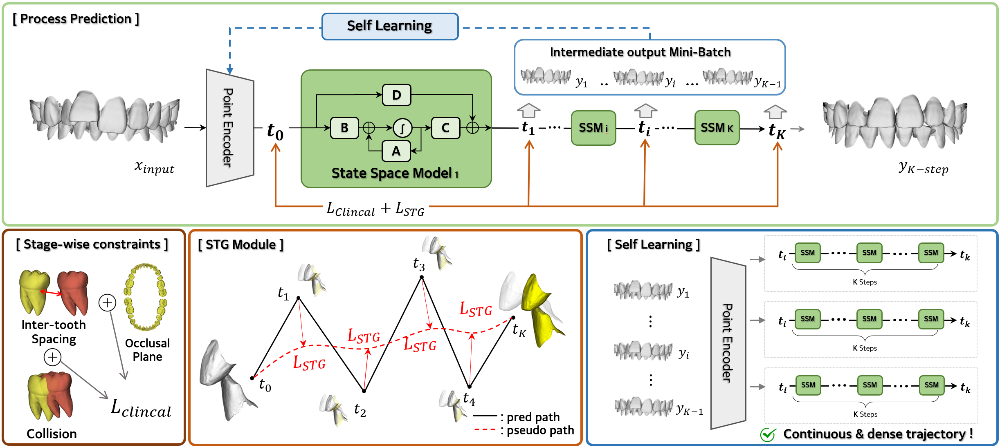
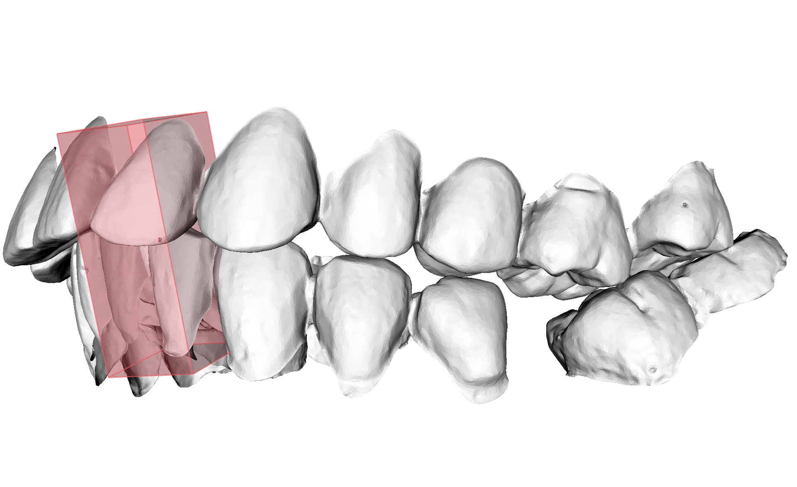
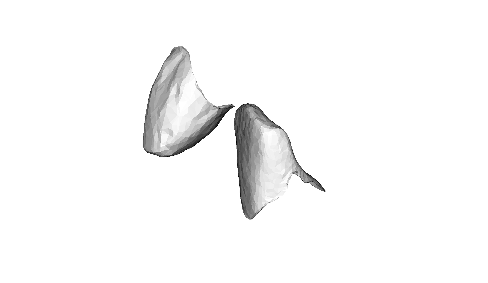

# ProMoT: Tooth Alignment via Virtual Trajectories with Clinical Constraints

[]()
[]()

Official implementation of:

> **Tooth Alignment via Virtual Trajectories with Clinical Constraints**

**ProMoT** formulates automatic tooth alignment as a virtual progressive tooth movement trajectory problem. Instead of directly predicting a one-shot final tooth pose, it predicts staged incremental rigid transformations and applies clinically motivated constraints along the intermediate trajectory.

<p align="center">
  
</p>

<p align="center">
  <table>
    <tr>
      <td align="center">
        <br>
        <sub>Full teeth trajectory</sub>
      </td>
      <td align="center">
        <br>
        <sub>Front teeth trajectory</sub>
      </td>
    </tr>
  </table>
</p>
---

## Highlights

- Progressive tooth movement modeling with staged 6-DoF transformations
- SSM-based sequential prediction for virtual trajectory generation
- Trajectory stabilization and intermediate-state self-learning
- Stage-wise clinical constraints for collision, occlusal-plane, and spacing evaluation
- Training from pre-/post-treatment IOS data

---

## Repository Structure

```text
ProMoT/
├── train.py                 # main training entry
├── evaluation.ipynb         # evaluation and result analysis
├── metric.py                # evaluation metrics
├── requirements.txt
│
├── config/                  # experiment and model configs
│   ├── train.yaml
│   └── model/
│       ├── encoder/
│       ├── ssm/
│       └── decoder/
│
├── data/                    # preprocessing and data loading
├── models/                  # ProMoT model components
├── loss/                    # training losses and clinical terms
├── utils/                   # geometry, saving, and stage augmentation utilities
├── image_models/            # local timm-related modules
└── assets/                  # figures for README and paper visualization
```

---

## Environment

The experiments were conducted with:

```text
Python 3.8.17
PyTorch 2.4.1+cu112
```

Install the required packages with:

```bash
conda create -n promot python=3.8.17
conda activate promot
pip install -r requirements.txt
```

PyTorch3D installation can depend on the local CUDA/PyTorch setup. Please install a compatible PyTorch3D build for your environment.

---

## Dataset

This project uses the public pre-/post-treatment dental model dataset available at:

```text
https://zenodo.org/records/15834700
```

After downloading the dataset, organize the data according to the expected project format and update the dataset paths in the config file or split file.

A typical split file should contain train/validation/test case lists and the data root path:

```json
{
  "data_root": "/path/to/processed_dataset",
  "train": ["data_001", "data_002"],
  "val": ["data_003"],
  "test": ["data_004"]
}
```

---

## Preprocessing

The preprocessing utilities are located in `data/`.

```bash
python data/data_processing.py
```

Before running preprocessing, set the input and output paths according to your local dataset location. The processed data are used by `train.py` through the split file and config file.

---

## Training

Training is controlled by YAML files under `config/`.

To run the ProMoT setting:

```bash
python train.py --config config/train.yaml
```

To check the resolved configuration before training:

```bash
python train.py --config config/train.yaml --print_config
```

Checkpoints and logs are saved under the output directory specified in the selected config file.

---

## Evaluation

Validation is performed during training when a validation split is provided. For post-hoc evaluation and paper-table analysis, use:

```text
evaluation.ipynb
```

The main metrics include ADD/AUC, ADD, AAE, mean rotation error, and mean translation error.

---

## Results

### Quantitative Comparison

| Method | ADD/AUC ↑ | ADD ↓ | AAE ↓ | ME<sub>Rot</sub> ↓ | ME<sub>Trans</sub> ↓ |
|---|---:|---:|---:|---:|---:|
| TANet | 0.681 | 1.476 | 1.894 | 8.894 | 3.400 |
| TAlignNet | 0.704 | 1.426 | 1.773 | 7.776 | 2.892 |
| PSTN | 0.754 | 1.231 | 1.221 | 11.922 | 3.586 |
| STTAlign | 0.844 | 0.820 | 1.136 | 3.136 | 1.836 |
| **ProMoT** | **0.863** | **0.794** | **0.980** | **3.121** | **1.750** |

---

## Note on Virtual Trajectories

The intermediate states generated by ProMoT are virtual progressive tooth movement trajectories learned from pre-/post-treatment observations. **They are not directly supervised by clinically observed intermediate scans.**

---

## Codebase Acknowledgement

This project was developed based on the STTAlign codebase:

```text
https://github.com/sgvdzfbxfb/STTAlign
```

We thank the authors of STTAlign for releasing their implementation.

---
